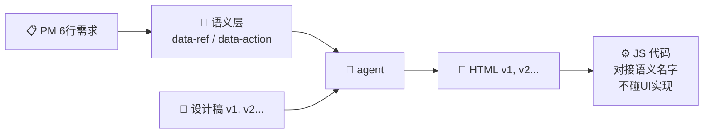
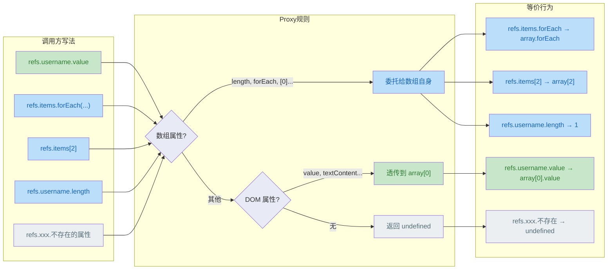

# 语义 + 设计稿 + Agent = 前端代码

🎯 零依赖 · 🪶 <1KB each · 📦 两个函数搞定

先定义"这个页面有哪些功能、哪些字段"（语义层），再由 agent 根据设计稿生成 HTML。  
`data-*` 属性是语义和 HTML 之间的契约——**不管设计稿怎么变，只要契约不变，业务代码就不需要动**。

> **为什么推荐？**
> - **语义先行** — 先定功能再出 UI，减少反复沟通
> - **UI 自由迭代** — agent 重新生成 HTML 即可，JS 不用改
> - **开发并行** — 语义定义好后，设计和开发可以各自独立推进

---

## 快速体验

同一份 JS（`shared.js`），agent 根据不同的设计稿生成不同风格的 HTML——豆包风格、Material Design 风格……交互逻辑完全不用改。所有交互由 `data-ref` 和 `data-action` 驱动，零依赖，在浏览器直接打开就能跑。

---

## 真实案例：从需求到代码

用一个真实的 AI 聊天助手项目，展示完整的流程。

### 起点：产品经理说了 6 行

> **AI 聊天助手** — 全屏左右布局，类似豆包/文心一言/ChatGPT 的标准对话界面。
>
> **左侧**：深色会话栏，顶部可搜索会话，下方历史会话列表，支持切换、删除、新建。
>
> **右侧**：聊天区 + 底部输入框，支持回车/按钮发送、文件上传，AI 会流式回复。顶部显示当前会话标题，可切换模型。
>
> **首次打开**：显示欢迎语和快捷提问卡片。
>
> **整体**：支持亮色/暗色模式切换。

### Step 1 → 语义层

从 PM 的 6 行中提取出 HTML 与 JS 之间的契约：

**data-ref（UI 元素引用）**

| ref 名 | 对应 PM 描述 |
|--------|-------------|
| `sessionList` | "左侧历史会话列表" |
| `chatMessages` | "右侧聊天区" |
| `chatInput` | "底部输入框" |
| `searchInput` | "顶部搜索会话" |
| `typingIndicator` | "AI 流式回复时的打字动画" |
| `welcomeScreen` | "欢迎语和快捷提问卡片" |
| `modelSelector` | "模型切换下拉框" |

**data-action（用户操作）**

| action 名 | 对应 PM 描述 |
|-----------|-------------|
| `sendMessage` | "回车/按钮发送" |
| `selectSession` | "切换会话" |
| `newSession` | "新建会话" |
| `deleteSession` | "删除会话" |
| `searchSession` | "搜索会话" |
| `clearMessages` | "清空当前会话" |
| `quickQuestion` | "快捷提问卡片" |
| `switchModel` | "切换模型" |
| `uploadFile` | "上传文件" |

### Step 2 → 设计稿

设计师给出视觉稿——布局、配色、交互样式。设计稿可以有多版（v1、v2、v3……甚至可以来自不同设计师），但不管哪版，语义层都不需要动。

> 设计稿具体是什么样子不重要，重要的是 step 1 定义的 `data-ref` / `data-action` 是稳定的。

### Step 3 → agent 根据语义 + 设计稿生成 HTML

把语义层的 data-ref/data-action 标到设计稿对应的 HTML 元素上。设计稿改三版，这些属性名不变。

```html
<!-- 不管设计怎么变，语义名不变 -->
<input data-ref="chatInput" data-action="sendMessage">
<button data-action="sendMessage">发送</button>
```

### Step 4 → JS 只对接语义名

```javascript
const refs = useDataRef({ root });
useDataAction({
  root,
  actions: { sendMessage, newSession, switchModel, /* ... */ }
});
```

JS 只认 `data-ref="chatInput"` 这个名字，不关心它在页面的哪个位置、是什么样式。

### 结果：设计稿随便换，JS 不用改

两个 Demo（v1、v2）共用同一份 `shared.js`，就是最好的证明。

---

## 架构概览



| 层 | 谁负责 | 内容 | 变动频率 |
|----|--------|------|---------|
| 📋 **PM 需求** | 产品经理 | 6 行描述——有什么、能干嘛、什么约束 | 低 |
| 📝 **语义层** | 产品/业务 | data-ref（字段）、data-action（功能）的名字清单 | 低 |
| 🎨 **设计稿** | 设计师 | 布局、配色、交互样式 | 中～高 |
| 🔄 **agent** | 开发/AI/工具 | 把语义 + 设计稿转成 HTML | — |
| 📄 **HTML** | agent 输出 | 用 `data-ref` 标记字段、`data-action` 标记功能 | 随设计变 |
| ⚙️ **JS 代码** | 前端 | 通过 `useDataRef()` / `useDataAction()` 对接语义名 | 语义不变就不改 |

---

## 语义 vs 非语义

```diff
 <!-- ❌ 非语义 — 改 UI 就得改 JS -->
 <div class="card">
-  <input class="input-email">
+  <input class="input-email-light">
-  <button class="btn-submit">登录</button>
+  <a class="btn-submit">🔑</a>
 </div>

 <!-- ✅ 有语义 — UI 随便改，JS 不用动 -->
 <div class="card">
-  <input data-ref="email" class="input-email">
+  <input data-ref="email" class="input-email-light">
-  <button data-action="login" class="btn-submit">登录</button>
+  <a data-action="login" class="btn-submit">🔑</a>
 </div>
```

---

## data-ref 和 data-action — HTML 与 JS 之间的契约

同名多元素写起来不分"单个还是多个"——底层用 Proxy 做智能分发：


